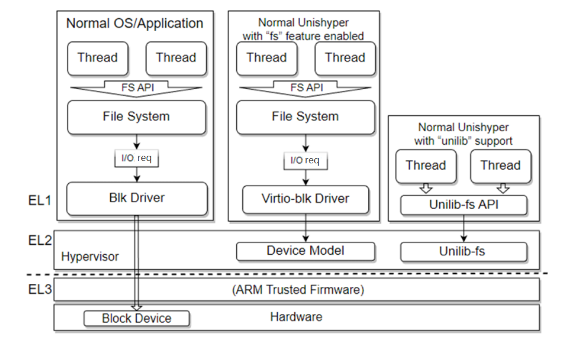

# Unishyper

Unishyper: A Rust-based Unikernel Enhancing Reliability and Efficiency of Embedded Systems. 

[Unishyper](https://gitee.com/unishyper/unishyper) is now open sourced at Gitee under Mulan PSL v2.

## Boards and Platforms

Unishyper  now supports following platforms:

| MACHINE | ARCH                    | Description                             |
|---------|-------------------------|-----------------------------------------|
| qemu    | **aarch64**  | QEMU/KVM (qemu-system-aarch64) |
| shyper  | **aarch64**  |  [Shyper](https://gitee.com/openeuler/rust_shyper) Type-1 Hypervisor         |
| tx2     | **aarch64**  | [NVIDIA TX2](https://developer.nvidia.com/embedded/jetson-tx2)                 |
| qemu    | **x86_64**   | QEMU/KVM (qemu-system-x86_64)  |
| qemu    | **riscv64**  | QEMU/KVM (qemu-system-riscv64)|
| k210    | **riscv64**  | [Kendryte K210](https://wiki.sipeed.com/hardware/en/maix/maixpy_develop_kit_board/Maix_dock.html) on [Maix Dock(M1/M1W)](https://wiki.sipeed.com/hardware/en/maix/maixpy_develop_kit_board/Maix_dock.html) |
| ~~raspi4~~    | **aarch64**  | ~~Raspberry Pi 4 Model B~~ (upcoming) |


## Features

1. Singal address space, singal priveledge level.
2. SMP support, multi-thread support.
3. Network stack and file system support.
4. Virtio drivers (virtio-net, virtio-blk).
5. Terminal support.
6. Unilib-fs support.
7. Zone, thread grained memory isolation mechanism.
8. Rust-std support, with modified [rust-toolchain](https://gitee.com/unishyper/rust).
9. Unwind based fault tolerance.
10. Parts of [axdriver](https://github.com/rcore-os/arceos/tree/main/modules/axdriver) ported from [ArceOS](https://github.com/rcore-os/arceos) is suppported (bus-mmio), feature `'axdriver'` is required.

## Architecture


## Unilib Interface



A set of interfaces based on the idea of offload that spans unikernel and the running hypervisor platform. Based on Unilib, unikernels can conveniently use the rich general-purpose library interfaces provided by general purpose OSs
running in other virtualized partitions, and choose to offload part of the protocol stack, further simplifying the unikernel structure.


The introduction of Unilib allows unikernel to choose to abandon the complex and huge device drivers and libraries code, which greatly simplifies the code size of Unikernel.

## Zone-isolation based on MPK

Beyond memory management based on Rust, Unishyper’s Zone mechanism provides extra protection and safe risks that may escape Rust security insurance. Based on Zone, thread memory access permissions can be divided at a finer granularity.

On x86_64 architecture, Unishyper uses Memory Protection Keys (MPK) from Intel to achieve a Zone Demo.


## Fault tolerance based on Unwind

Unishyper implements a fault tracing and tolerance mechanism based on Rust’s unwind, which includes backtracing error call chains, recording error logs, handling faults, releasing resources, and restart trying.


## Toolchains

1. Nightly Rust (`nightly-2022-09-14` tested)
2. `rust-src` component (use `make dependencies` to install)
3. QEMU emulator version 5.0.0
4. mkfs from util-linux 2.31.1 (for making disk.img, see Makefile for details)
5. [cargo-binutils](https://github.com/rust-embedded/cargo-binutils) for using `rust-objcopy` and `rust-objdump` tools
6. [Rboot](https://github.com/hky1999/rboot.git) for bootloader on x86_64
7. K210 `kflash` tool [kflash.py](https://github.com/kendryte/kflash.py) for [Maix Dock(M1/M1W)](https://wiki.sipeed.com/hardware/en/maix/maixpy_develop_kit_board/Maix_dock.html) flashing.
8. `mkimage` u-boot image tool

## Applications

The examples directory contains example demos.

For build preparation:


```bash
cargo install cargo-binutils

# See .gitmodules for details
git submodule update --init --recursive
```

use this lines to build and emulate:

```
make ARCH=<arch> MACHINE=<platform> APP=<app_dir> APP_BIN=<app_bin> LOG=<log_level> run

# for examples/hello_world
ARCH=x86_64 APP=hello_world make run
# for examples/net_tcp_bench
ARCH=aarch64 APP=net_tcp_bench APP_BIN=server-bw NET=y make run
```

## Terminal Support

The unishyper support command line interaction through a simple terminal implementation with "terminal" feature enabled. The simple terminal supports basic input and output, and some basic file operations, including ls, mkdir, cat, e.g.

You can input "help" in terminal for more information.

```bash
☻ SHELL➜ help
This is unishyper,
a research unikernel targeting a scalable and predictable runtime for embedded devices.
List of classes of commands:

cat [FILE]      -- Concatenate files and print on the standard output, "fs" feature is required.
free            -- Dump memory usage info.
kill [TID]      -- Kill target thread according to TID, you can use "ps" command to check running threads.
ls [DIR]        -- List information about the FILEs (the current directory by default), "fs" feature is required.
mkdir [DIR]     -- Create the DIRECTORY, if they do not already exist, "fs" feature is required.
ps              -- Report a snapshot of the current threads, you can use "run [TID]" to wake the ready ones.
run [TID]       -- Run target thread according to TID, you can use "ps" command to check available threads.
help            -- Print this message.

☻ SHELL➜

```

## Network Support
To enable an ethernet device, we have to setup a tap device on the
host system. For instance, the following command establish the tap device
`tap0` on Linux,  or you can just run `make tap_setup` to set up tap device for network support.

```bash
sudo ip tuntap add tap0 mode tap
sudo ip addr add 10.0.0.1/24 broadcast 10.0.0.255 dev tap0
sudo ip link set dev tap0 up
sudo bash -c 'echo 1 > /proc/sys/net/ipv4/conf/tap0/proxy_arp'
```

Add the feature `net` in the `Cargo.toml`. Unishyper use the network stack [smoltcp](https://github.com/smoltcp-rs/smoltcp) to offer TCP/UDP communication.

By default, Unishyper's network interface uses `10.0.0.2` as IP address, `10.0.0.1`
for the gateway and `255.255.255.0` as network mask.

Currently, Unishyper does only support network interfaces through [virtio-net](https://www.redhat.com/en/blog/introduction-virtio-networking-and-vhost-net).
To use it, you have to start Unishyper in Qemu with following parameters:

```Makefile
QEMU_NETWORK_OPTIONS := -netdev tap,id=tap0,ifname=tap0,script=no,downscript=no \
						-device virtio-net-device,mac=48:b0:2d:0e:6e:9e,netdev=tap0 \
						-global virtio-mmio.force-legacy=false
```
 You may see Makefile for details.

 ## FS Support

 Currently Unishyper provides two types of file system, including Fatfs based on virtio and Unilib-fs based on Unilib API running on rust hypervisor. 

### Fatfs

To enable Fatfs, we need to enable the features `fs` and `fat`, and prefare a disk.img for it. The following command make a disk image from zero, or you can just run `make disk` to prepare a disk img.
```Makefile
dd if=/dev/zero of=disk.img bs=4096 count=92160 2>/dev/null
mkfs.fat -F 32 disk.img
```

Unishyper use the [fatfs](https://github.com/rafalh/rust-fatfs) to offer fatfs support.

Currently, Unishyper does only support blk operation through [virtio-blk](https://www.qemu.org/2021/01/19/virtio-blk-scsi-configuration/).
To use it, you have to start Unishyper in Qemu with following parameters:

```Makefile
QEMU_DISK_OPTIONS := -drive file=disk.img,if=none,format=raw,id=x0 \
					 -device virtio-blk-device,drive=x0,bus=virtio-mmio-bus.0 \
					 -global virtio-mmio.force-legacy=false
```
You may see Makefile for details.

### Unilib-FS

Unishyper's Unilib-FS is based on the support of [Rust-Shyper](https://gitee.com/openeuler/rust_shyper). Unishyper's fs operation request is passed to the MVM by a HVC request from Unishyper and a IPI request inside hypervisor. The MVM will perform the file operation on its user daemon process and send the result back to Unishyper.

Through the thought of unilib, Unishyper can get rid of the huge code size of file system and block device driver, replaced with just a few lines of HVC calls.